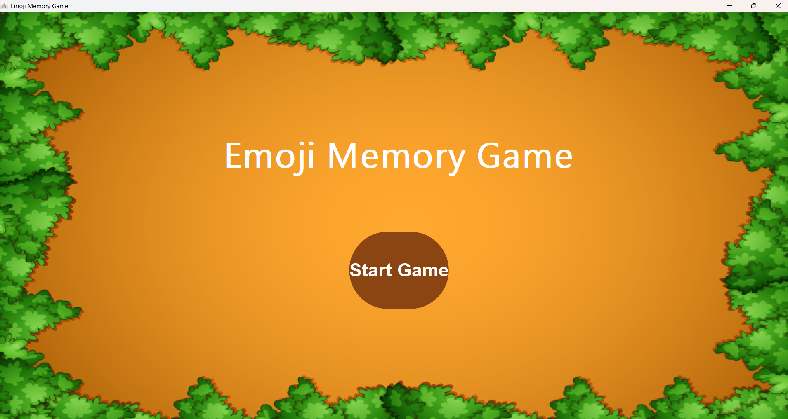
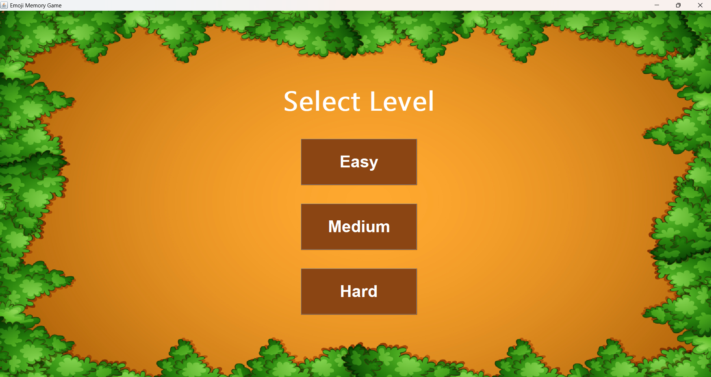
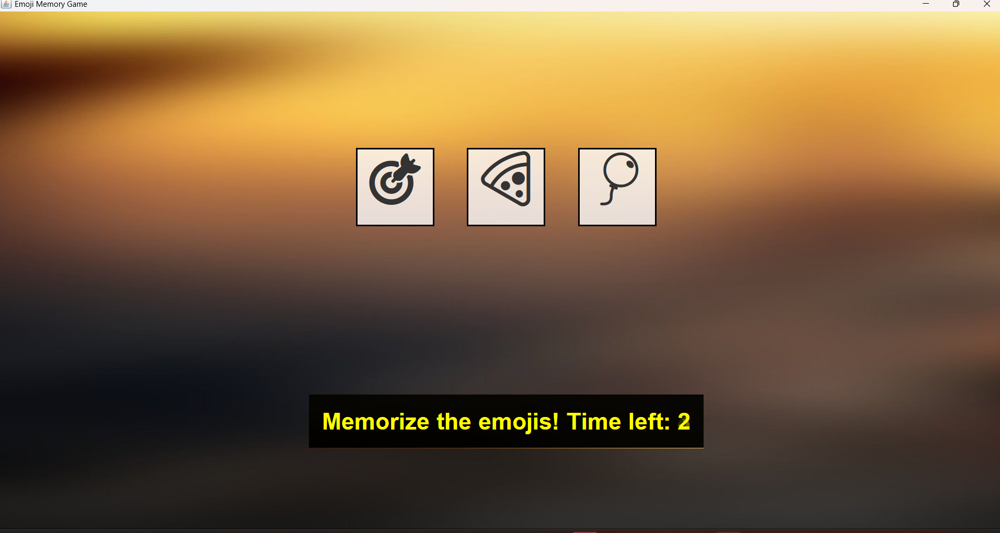
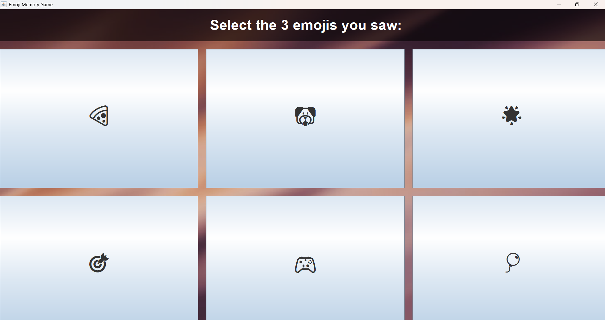
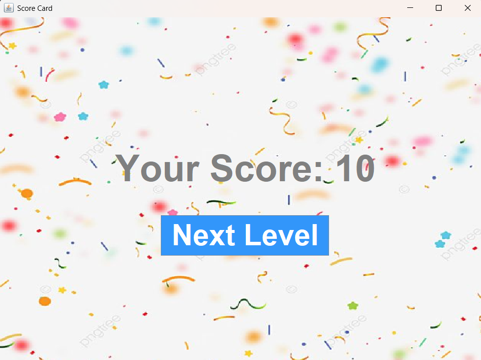

# EmojiMemoryGame 🎮🐶🍕

A fun **Java Swing-based memory game** where players memorize and match sequences of emojis. Perfect for testing your memory and reflexes!  

---

## **Features**
- Multiple difficulty levels: **Easy**, **Medium**, **Hard**  
- Emoji sequences displayed for a limited time  
- Interactive and colorful GUI using **Java Swing**  
- Timer to challenge memory skills  
- Responsive design with background images  

---

## **Screenshots**
  
  
  
  



---

## **How to Run**
1. Make sure you have **Java JDK** installed (Java 8 or higher).  
2. Clone the repository:
```bash
git clone https://github.com/yourusername/EmojiMemoryGame.git
```
3.Navigate to the project folder:
```
  cd EmojiMemoryGame
```
4.Compile the Java files:
```
  javac MiniEmojiMemoryGame.java
```
5. Run the game:
```
   java MiniEmojiMemoryGame
```
## **Folder Structure**
```bash
EmojiMemoryGame/
├─ images/           # Background and emoji images
├─ EmojiMemoryGame.java
├─ README.md
```
## GitHub Link
[EmojiMemoryGame Repository](https://github.com/khushnudatasmeer/EmojiMemoryGame)


